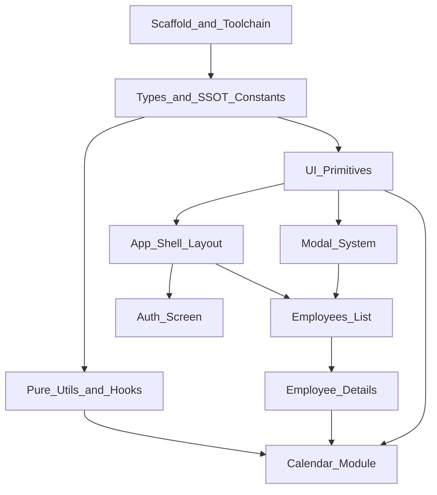

# HR Assist — Frontend Development Plan

This plan covers **v1.0.0 MVP only** per [docs/SPECIFICATION.en.md](docs/SPECIFICATION.en.md). All steps below have been implemented in `apps/web`.

## Global Constraints (apply to every step)

- **Light mode ONLY:** No `dark:` Tailwind variants, no theme toggle, no `prefers-color-scheme` switching. Configure Tailwind/Shadcn for a single light palette.
- **Zero layout shift:** Root shell is fixed `100vh` / `overflow-hidden`; scroll happens only inside designated inner containers (`overflow-y: auto`).
- **Strict TypeScript:** `strict: true`, no `any`, no `@ts-ignore`. Domain entities live in dedicated type files.
- **SSOT:** Constants, enums, and dictionaries in one place — never duplicated across components.
- **Modularity:** One responsibility per file; target **150–200 lines max** per component.
- **Polish UI copy:** User-facing strings in Polish (per spec examples: `Pracownicy`, `Zaloguj się`, etc.).

## Target Directory Layout

```
apps/web/
├── app/                    # Next.js App Router
│   ├── (auth)/login/
│   ├── (app)/              # Authenticated shell (sidebar + main)
│   │   ├── employees/
│   │   └── dni-wolne/      # Placeholder route (nav tab exists; no MVP detail spec)
│   ├── layout.tsx
│   └── globals.css
├── components/
│   ├── layout/             # Aside, Main, ProfilePopover
│   ├── ui/                 # Shadcn + custom primitives
│   ├── employees/
│   ├── calendar/
│   └── modals/
├── lib/
│   ├── constants/          # SSOT dictionaries
│   ├── types/              # Domain types
│   ├── utils/              # PESEL, FTE, dates, editability
│   └── hooks/              # useFuseSearch, useClickOutside, etc.
└── services/               # API client (thin fetch wrappers)
```

## Dependency Flow



---

## Phase 0 — Project Scaffold & Toolchain

- [x] **Step 1: Initialize Next.js app in `apps/web`**
  - Create Next.js (App Router) + TypeScript project at [`apps/web`](apps/web).
  - Use `src/` optional; prefer flat `app/` at `apps/web/app/` for clarity.
  - Add path alias `@/*` → project root.

- [x] **Step 2: Enforce strict TypeScript**
  - Enable `strict`, `noImplicitAny`, `strictNullChecks`, `noUncheckedIndexedAccess` in [`apps/web/tsconfig.json`](apps/web/tsconfig.json).
  - Add ESLint rule banning `any` (`@typescript-eslint/no-explicit-any: error`).
  - **Constraint:** No `@ts-ignore` / `@ts-expect-error` without documented exception.

- [x] **Step 3: Configure Tailwind CSS (light mode only)**
  - Install and configure Tailwind + PostCSS.
  - Set `darkMode: false` (or omit dark mode entirely).
  - Define CSS variables for a single light theme in [`apps/web/app/globals.css`](apps/web/app/globals.css).
  - **Constraint:** Do not add `dark:` classes anywhere.

- [x] **Step 4: Initialize Shadcn UI (light theme)**
  - Run Shadcn init with default light styling.
  - Install only primitives needed early: `button`, `input`, `label`, `select`, `popover`, `progress`, `tooltip`, `dialog` (for confirm), `tabs`.
  - **Constraint:** Strip/disable any dark-mode token pairs from generated theme.

- [x] **Step 5: Add Fuse.js dependency**
  - Install `fuse.js` + types; no wrapper code yet.

- [x] **Step 6: Establish folder structure & barrel exports**
  - Create `components/`, `lib/constants/`, `lib/types/`, `lib/utils/`, `lib/hooks/`, `services/`.
  - Add minimal `README` comment in each folder describing responsibility.

---

## Phase 1 — Domain Types & SSOT Constants

- [x] **Step 7: Define core domain types**
  - File: [`apps/web/lib/types/employee.ts`](apps/web/lib/types/employee.ts) — `Employee`, `EmployeeSummary`, `EmployeeStatus` (`OK` | `NN`), `Location` (`Biuro` | `Hala`), `ContractType`, `LegalEntity`, etc.
  - File: [`apps/web/lib/types/attendance.ts`](apps/web/lib/types/attendance.ts) — `AttendanceCode`, `DayAttendance`, `CalendarDay`, `MonthLockState`.
  - File: [`apps/web/lib/types/leave.ts`](apps/web/lib/types/leave.ts) — `LeaveBalance`, `LeavePool` (`20` | `26`), nullable pool handling.
  - File: [`apps/web/lib/types/auth.ts`](apps/web/lib/types/auth.ts) — `User`, `Session`, login DTOs.
  - **Constraint:** Strict TS — export unions/enums, no loose strings in UI later.

- [x] **Step 8: SSOT attendance dictionary (16 statuses)**
  - File: [`apps/web/lib/constants/attendance.ts`](apps/web/lib/constants/attendance.ts)
  - Map each code (OB, CH, NN, UB, UW, UM, NUN, NUP, UO, OP, REH, UR, UŻ, UOK, WZS, WYC) → `{ code, label, colorToken }`.
  - Export helper: `getAttendanceLabel(code)`, `ATTENDANCE_OPTIONS` for selects.

- [x] **Step 9: SSOT calendar & locale constants**
  - File: [`apps/web/lib/constants/calendar.ts`](apps/web/lib/constants/calendar.ts)
  - Polish month names (`STYCZEŃ`–`GRUDZIEŃ`), year range `2026`–`2036`, weekday labels.
  - Calendar column headers, lock tooltip strings.

- [x] **Step 10: SSOT employee form constants**
  - File: [`apps/web/lib/constants/employee-form.ts`](apps/web/lib/constants/employee-form.ts)
  - FTE fractions `1/8`–`8/8`, time window `04:00`–`22:00`, leave day bounds `0`–`26`, location options, contract type `UoP`, annual pool toggle values.

- [x] **Step 11: SSOT navigation & app metadata**
  - File: [`apps/web/lib/constants/navigation.ts`](apps/web/lib/constants/navigation.ts)
  - App name `HR Assist`, nav items (`Pracownicy`, `Dni wolne`), route paths, stub action messages (`Funkcja w przygotowaniu`).

---

## Phase 2 — Pure Utilities & Hooks (no UI)

- [x] **Step 12: Date formatting utilities**
  - File: [`apps/web/lib/utils/date.ts`](apps/web/lib/utils/date.ts)
  - Format helpers: `formatBirthDate`, `formatCalendarHeader` (`1 LIPCA 2026`), ISO parsing.
  - Use constants from Step 9 — no inline month names in components.

- [x] **Step 13: PESEL validation & birth-date derivation**
  - File: [`apps/web/lib/utils/pesel.ts`](apps/web/lib/utils/pesel.ts)
  - 11-digit validation (NPM algorithm per spec), real-time birth date extraction for display under input.

- [x] **Step 14: FTE & working-hours sync utilities**
  - File: [`apps/web/lib/utils/working-hours.ts`](apps/web/lib/utils/working-hours.ts)
  - Map FTE → daily hours; given start time + FTE → compute end time.
  - Validate window `04:00`–`22:00`; return `{ valid, errors }` for form gating.

- [x] **Step 15: Leave progress calculation**
  - File: [`apps/web/lib/utils/leave.ts`](apps/web/lib/utils/leave.ts)
  - Compute percentage used; handle null pool → `- / - dni` + `0%`.
  - Round to 2 decimal places (display `66,67%` per PL locale formatting).

- [x] **Step 16: Calendar day editability rules**
  - File: [`apps/web/lib/utils/calendar-editability.ts`](apps/web/lib/utils/calendar-editability.ts)
  - Pure function: editable iff month unlocked + weekday + not public holiday + not company UW day.
  - Return cursor hint (`pointer` | `not-allowed`).

- [x] **Step 17: Month lock state machine**
  - File: [`apps/web/lib/utils/month-lock.ts`](apps/web/lib/utils/month-lock.ts)
  - States: `current_month` (disabled lock), `manual_window` (days 1–10 next month, green active lock), `system_locked` (from day 11, red lock).
  - Export lock icon variant + tooltip text from SSOT constants.

- [x] **Step 18: Fuse.js search hook**
  - File: [`apps/web/lib/hooks/use-employee-search.ts`](apps/web/lib/hooks/use-employee-search.ts)
  - Configure Fuse keys: firstName, lastName, position, location, pesel.
  - Accept employee list + query → filtered list.

- [x] **Step 19: Click-outside & Escape hook**
  - File: [`apps/web/lib/hooks/use-dismissable.ts`](apps/web/lib/hooks/use-dismissable.ts)
  - Reusable for profile popover and modals: outside click, `Esc`, toggle on re-click.

---

## Phase 3 — UI Primitives (isolated, Storybook-free)

Build each in [`apps/web/components/ui/`](apps/web/components/ui/) or `components/` subfolders. Every step produces a static, prop-driven component with no route coupling.

- [x] **Step 20: App shell CSS foundation**
  - [`apps/web/app/globals.css`](apps/web/app/globals.css): `html, body { height: 100%; overflow: hidden }`.
  - Utility classes: `.app-shell`, `.scroll-pane` for inner scroll regions.
  - **Constraint:** 100vh shell; prevent document-level scroll.

- [x] **Step 21: Status indicator component**
  - `StatusIndicator` — green `OK` / red `NN` dot + label per spec.

- [x] **Step 22: Location badge component**
  - `LocationBadge` — visual badge (e.g. `Hala` + icon) for table cell.

- [x] **Step 23: Progress bar wrapper**
  - Thin wrapper over Shadcn `Progress`; accepts `value` 0–100, handles 0% null state.

- [x] **Step 24: Segmented control component**
  - `SegmentedControl<T>` — equal-width segments (used for `Biuro` | `Hala`, `20 dni` | `26 dni`).
  - Keyboard accessible; active segment styled with background + border.

- [x] **Step 25: Sticky-header scroll container**
  - `StickyTableContainer` — `overflow-y: auto` wrapper + `sticky top-0` opaque header slot.
  - Used by employee list and calendar grid.

- [x] **Step 26: Zebra HTML table primitives**
  - `DataTable`, `DataTableRow`, `DataTableCell` — row-level borders, no vertical cell borders, alternating row backgrounds.
  - Row click handler prop for navigation.

- [x] **Step 27: Pulsing row variant (NN status)**
  - CSS animation utility + `PulsingRow` wrapper — subtle red pulse for unexcused absence rows (employee list + calendar).

- [x] **Step 28: Icon button cluster**
  - `IconActionBar` — 4 icon buttons (Edit, Report, Archive, Delete) with stub `onAction` callback.

- [x] **Step 29: Combobox with custom entry**
  - `ComboboxInput` — suggestions list + free-text entry (Position field in add-employee modal).

- [x] **Step 30: Calendar status cell renderer**
  - `AttendanceStatusCell` — color-coded OB (green), NN (red + highlight), USP (orange) display codes.

---

## Phase 4 — Modal System

- [x] **Step 31: Base `<Modal />` component**
  - File: [`apps/web/components/modals/modal.tsx`](apps/web/components/modals/modal.tsx)
  - Centered panel, `backdrop-blur`, centered title, `[X]` close (top-right).
  - Footer slot with primary action button; `isSubmitDisabled` prop gates footer button.
  - Focus trap + `Esc` to close (unless loading).

- [x] **Step 32: Double-confirmation (`confirmConfig`)**
  - Extend Modal with optional `confirmConfig: { title, message, onConfirm }`.
  - Internal confirm dialog: _"Czy na pewno kontynuować?"_ before irreversible actions.
  - Used by month-lock confirmation.

- [x] **Step 33: Modal loading / backend-await UX guard**
  - `isPending` prop: disable close + actions while awaiting API.
  - **Spec rule:** Attendance edit modal closes only after backend response + grid re-render (implement pattern here; wire in Step 52).

---

## Phase 5 — App Shell & Layout

- [x] **Step 34: Root layout (`app/layout.tsx`)**
  - Wrap children in 100vh flex container; no page-level overflow.
  - **Constraint:** Light mode only; set `<html lang="pl">`.

- [x] **Step 35: Authenticated app layout group**
  - Route group `(app)/layout.tsx` — two-column grid: Aside (200–300px) + Main (`flex-1`, `100vh`).
  - **Constraint:** Fixed dimensions; zero CLS on navigation.

- [x] **Step 36: Sidebar header tile**
  - `SidebarHeader` — `HR Assist` branding tile.

- [x] **Step 37: Sidebar navigation tabs**
  - `SidebarNav` — links `Pracownicy` + `Dni wolne`; active tab gets background + border highlight.
  - Use `usePathname()` for active state; links from SSOT constants.

- [x] **Step 38: Profile tile (collapsed state)**
  - `ProfileTile` — initials circle, full name, right arrow; no menu yet.

- [x] **Step 39: Profile popover menu**
  - Extend `ProfileTile`: click darkens tile, rotates arrow, opens popover with `Wyloguj się`.
  - Dismiss via re-click, outside click, `Esc` (use Step 19 hook).

- [x] **Step 40: Main content stage**
  - `MainStage` — fills remaining viewport; inner pages manage their own scroll panes.

---

## Phase 6 — API Layer & Auth (thin integration)

- [x] **Step 41: Typed API client skeleton**
  - File: [`apps/web/services/api-client.ts`](apps/web/services/api-client.ts)
  - Base fetch wrapper with typed responses/errors; env-based `API_URL`.
  - No mock data in components — SSOT for API calls lives here.

- [x] **Step 42: Auth service stubs**
  - `services/auth.ts` — `login`, `logout`, `getSession` typed methods (align with future NestJS endpoints).

- [x] **Step 43: Login page — static layout**
  - Route: [`apps/web/app/(auth)/login/page.tsx`](<apps/web/app/(auth)/login/page.tsx>)
  - Centered square container; vertical stack: profile icon → Email → Password → `Zaloguj się`.
  - **Constraint:** Full viewport centered; no sidebar.

- [x] **Step 44: Login form validation & submit**
  - Controlled inputs, basic validation, submit handler calling auth service.
  - On success → redirect to `/employees`.

- [x] **Step 45: Auth guard for `(app)` routes**
  - Middleware or layout-level session check; unauthenticated → `/login`.
  - Logout clears session/cookies → `/login`.

---

## Phase 7 — Employees List View (`/employees`)

- [x] **Step 46: Page shell & top bar**
  - [`apps/web/app/(app)/employees/page.tsx`](<apps/web/app/(app)/employees/page.tsx>)
  - Top bar: search input + square `+` button (opens modal — wired later).

- [x] **Step 47: Integrate Fuse.js search**
  - Connect search input → `useEmployeeSearch` → filtered table data.
  - Search fields: Imię, Nazwisko, Stanowisko, Lokalizacja, PESEL.

- [x] **Step 48: Employee table assembly**
  - Columns (UPPERCASE, centered): `IMIĘ`, `NAZWISKO`, `STANOWISKO`, `LOKALIZACJA`, `STATUS`.
  - Zebra rows, sticky header, internal scroll via Step 25 container.

- [x] **Step 49: Row interactions & status rendering**
  - Row click → `/employees/[id]`.
  - Location badge cell; OK/NN status indicators; NN rows use pulsing animation.

- [x] **Step 50: Add Employee modal — Row 1 (identity)**
  - Fields: Imię, Nazwisko, PESEL with live birth-date helper text (Step 13 utils).

- [x] **Step 51: Add Employee modal — Row 2 (contract & hours)**
  - Typ umowy (locked `UoP`), Wymiar etatu (1/8–8/8), Start/End time with sync logic (Step 14).
  - Red field highlight + disabled submit when outside `04:00`–`22:00`.

- [x] **Step 52: Add Employee modal — Row 3 (placement)**
  - Segmented control Location; Combobox Position; Legal Entity dropdown.

- [x] **Step 53: Add Employee modal — Row 4 (leave)**
  - Numeric Urlop zaległy (0–26); annual pool segmented toggle (20 / 26 dni).

- [x] **Step 54: Add Employee modal — validation & submit**
  - Footer submit disabled until all rows valid; call API; close on success; refresh list.

---

## Phase 8 — Employee Details View (`/employees/[id]`)

- [x] **Step 55: Detail page shell & data fetching**
  - Route: [`apps/web/app/(app)/employees/[id]/page.tsx`](<apps/web/app/(app)/employees/[id]/page.tsx>)
  - Fetch employee by id; loading/error states.

- [x] **Step 56: Tabs component integration**
  - Top tabs: `Dane pracownika` | `Urlopy` (Shadcn Tabs or custom matching spec).

- [x] **Step 57: Tab 1 — Employee data display**
  - Four text rows per spec (UPPERCASE name, PESEL + birth date, position line, hours line).

- [x] **Step 58: Tab 1 — Action bar stubs**
  - Four icon buttons → `alert("Funkcja w przygotowaniu")` (Edit, Report, Archive, Delete).

- [x] **Step 59: Tab 2 — Leave balances grid**
  - Two-column grid: Zaległy + Progress | Aktualny + Progress.
  - Null pool → `- / - dni`, 0% bar; percentages via Step 15 formatter.

- [x] **Step 60: Persistent calendar section wrapper**
  - Calendar module rendered below tabs regardless of active tab.
  - Layout: tabs area scroll-independent from calendar scroll if needed within MainStage.

---

## Phase 9 — Calendar Module

- [x] **Step 61: Calendar header — date navigation**
  - `<` button → month select → year select → `>` button.
  - Disable arrows at Jan 2026 / Dec 2036 boundaries.

- [x] **Step 62: Calendar header — lock control**
  - Lock icon button with three visual states (Step 17 machine).
  - Tooltips from SSOT constants; click active lock → confirm modal (Step 32).

- [x] **Step 63: Locked month overlay behavior**
  - When locked: grid `opacity` reduced, pointer-events disabled, `cursor: not-allowed`.

- [x] **Step 64: Calendar grid table**
  - 6 columns: Dzień, Dzień tygodnia, Godziny pracy, Nominalny czas, Realny czas, Status.
  - Sticky header + scroll container; status cells via Step 30.

- [x] **Step 65: Day cell click handler**
  - Only editable days (Step 16) open attendance modal; others stay inert with `not-allowed`.

- [x] **Step 66: Attendance edit modal — layout**
  - Header: formatted date; 3 equal-width controls: Select, `Usuń frekwencję`, `Aktualizuj`.

- [x] **Step 67: Attendance edit modal — API integration**
  - Save/delete call API; `isPending` blocks close; on success re-fetch month data then close (Step 33 pattern).

---

## Phase 10 — Secondary Routes & Hardening

- [x] **Step 68: `Dni wolne` placeholder route**
  - Route: [`apps/web/app/(app)/dni-wolne/page.tsx`](<apps/web/app/(app)/dni-wolne/page.tsx>)
  - Nav tab works; show MVP placeholder (spec defines tab but no v1 detail — defer features to v2).

- [x] **Step 69: Employee service & calendar service**
  - `services/employees.ts`, `services/attendance.ts` — typed CRUD/list/month-fetch methods.

- [x] **Step 70: Centralized loading & error UI**
  - Shared `LoadingSpinner`, `ErrorMessage` components; consistent placement without layout shift.

- [x] **Step 71: Final layout stability audit**
  - Verify: no document scroll, sidebar fixed 100vh, sticky headers opaque, no CLS on tab/modal open.
  - **Constraint checklist:** Light mode only ✓ | 100vh ✓ | Strict TS ✓.

- [x] **Step 72: File size & SSOT audit**
  - Split any file >200 lines; grep for duplicated constants/strings; consolidate into `lib/constants/`.

---

## Out of Scope (v2.0.0+ — do not implement)

- RBAC / multi-role auth
- Report PDF/XLSX export (Report button stays stubbed)
- Edit / Archive / Delete employee modals (stay stubbed)
- Email/Slack notifications
- Dark mode / theme switching

## Suggested Execution Rhythm

1. Complete one checkbox per PR or per session.
2. Each step should be verifiable in isolation (render primitive on a temp page, or unit-test pure utils).
3. Do not skip Phase 1–2 — types and constants block nearly every UI step.
4. Backend integration steps (41–45, 54, 67, 69) may use typed mocks initially if API is not ready; mocks live in `services/` only, never in components.
